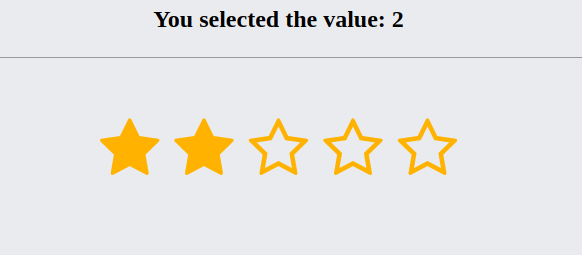

# Five star ratings component



## Using only CSS to build the component
```css
body {
	color: #000;
	background: #eaebef;
	font: 700 16px/1.5 Verdana;
}

#section-result{
    border-bottom: 1px solid #999;
    margin-bottom: 50px;
}

#section-rating, h1{
	text-align: center;
}

.set {
	display: inline-block;
	font-size: 3rem;
	border: none;
}

.set:after {
	content: "";
	display: table;
	clear: both;
}

.star {
	float: right;
	padding-left: 15px;
	cursor: pointer;
	color: #FFB300;
}

.star:last-child {
	padding-left: 0;
}

.star:hover:before, .star:hover~.star:before, .rd:checked~.star:before {
	content: "\f005";
}

.rd {
	display: none;
}

.rating {
	font-size: 0;
}
```

## Using JavaScript to get the selected value
```javascript
function showresult(res){
	document.getElementById('result').innerText = "You selected the value: " + res;;
}

document.getElementById('rd1').addEventListener('click', function(){
	showresult(1);
});

document.getElementById('rd2').addEventListener('click', function(){
	showresult(2);
});

document.getElementById('rd3').addEventListener('click', function(){
	showresult(3);
});

document.getElementById('rd4').addEventListener('click', function(){
	showresult(4);
});

document.getElementById('rd5').addEventListener('click', function(){
	showresult(5);
});
```
